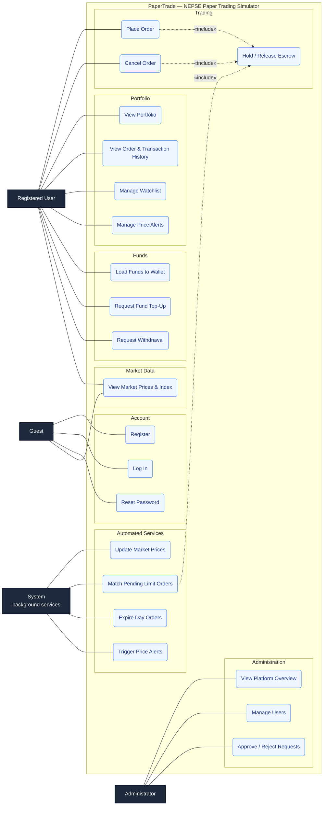
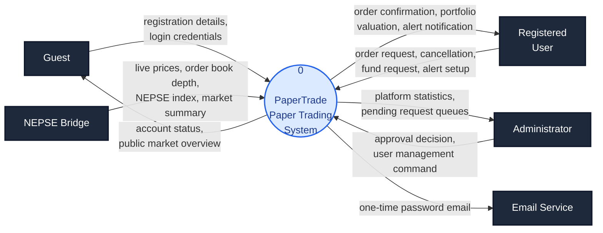
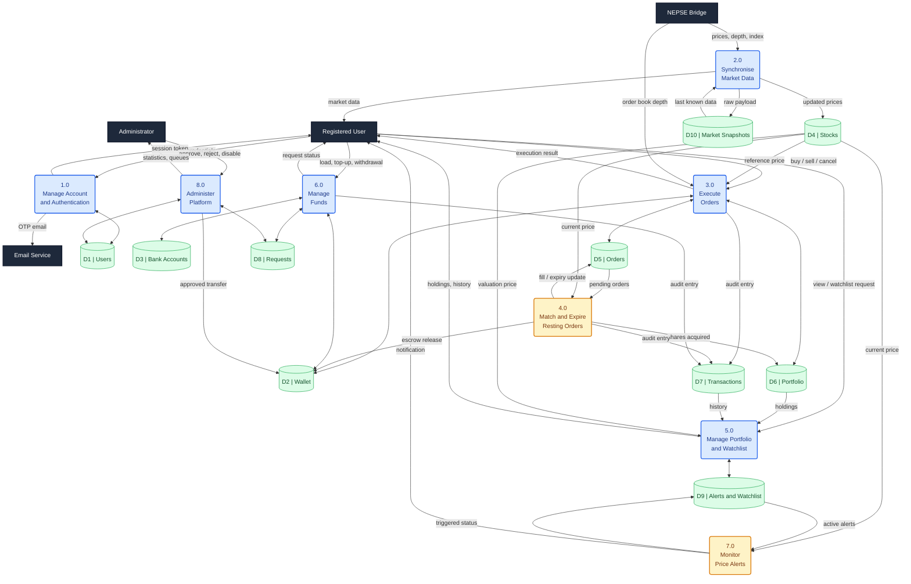
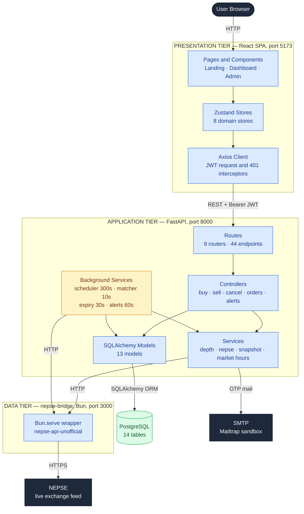
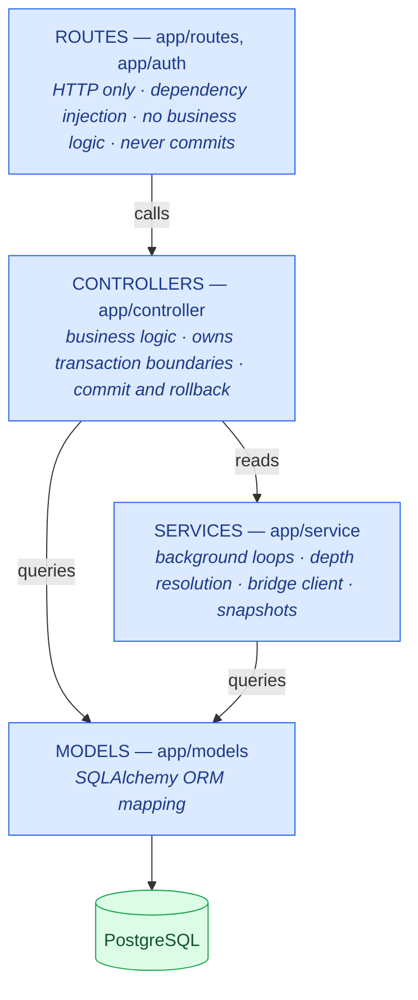

# PaperTrade — Diagrams

Source for the diagrams used in the final year project report.
See `report.md` §18 for the full list of diagrams the report needs.

> **For the report, use `usecase.drawio.xml`, not the Mermaid below.**
> draw.io's Mermaid importer discards the layout and re-routes every edge with
> its own orthogonal router, which is what tangles the lines. The `.drawio.xml`
> file is native draw.io with every node and edge anchor placed by hand, so it
> opens correctly formatted. The Mermaid version is kept as a readable text
> reference and for GitHub/Markdown previews.

---

## 1. Use Case Diagram

### 1a. draw.io version — use this one for the report

Open `usecase.drawio.xml` in draw.io:

- **File → Open From → Device**, select the file; or
- **Extras → Edit Diagram…**, paste the file contents, **OK**.

Export with **File → Export as → PNG**, zoom 300%, transparent background off,
border width 10. Do *not* run **Arrange → Layout** — that would re-run the same
auto-router that caused the original problem.

Layout decisions baked into the coordinates:

| Choice | Reason |
|---|---|
| Straight association lines (`edgeStyle=none`) | Orthogonal routing is what produced the tangle. Straight lines are also correct UML for associations. |
| `Guest`/`Registered User` left, `Administrator`/`System` right | Halves the horizontal span each edge must cross. |
| Fixed exit anchors fanned down the actor's side (`exitY=0.3 … 0.75`) | Stops eleven `Registered User` edges emerging from one point and overlapping. |
| Escrow placed in its own right-hand column at `x=650` | The three `«include»` arrows reach it through the empty corridor between the main column and the boundary, crossing nothing. |
| Vertical order = Guest → Trader → Admin → System | Each use case sits beside the actor that calls it, so no association line travels the full height. |

Colour coding: blue = user-facing, amber = automated/background, green =
internal (reached only via `«include»`). A legend box is included bottom-left.

### 1b. Mermaid version — text reference

Mermaid has no native use-case notation, so this uses a `flowchart` with actors
outside a system-boundary subgraph.

### Points to defend in the viva

**`System` is a primary actor.** Unusual for a student project, and that is the
point — the four background loops (`schedular.py`, `matcher.py`,
`expiration.py`, `alert_checker.py`) initiate U18–U21 with no human trigger.
Omitting this actor would misrepresent the system as purely request-driven.

**`Admin` does *not* generalise from `Registered User`.** There is deliberately
no inheritance arrow, because `ProtectedRoute` in `App.jsx` redirects admins to
`/admin` — an administrator genuinely cannot place orders. Drawing the usual
`Admin ▷ User` generalisation would contradict the implementation.

**The three `«include»` arrows point at escrow** because that is the single
invariant the whole money model rests on: placing an order holds capital,
cancelling releases it, and the matcher releases the unused portion on a fill.
The same formula must be applied by all three, or balances drift.

---

## 2. Data Flow Diagram — Level 0 (Context Diagram)

The whole system as a single process, showing every external entity it exchanges
data with. Note that **NEPSE Bridge is a source, never a sink for business
data** — the platform only ever *reads* from it, because all trades are
simulated and nothing is ever sent to the real exchange. That one-way arrow is
the single most important thing this diagram communicates.

---

## 3. Data Flow Diagram — Level 1

Process 0 decomposed into eight processes and the data stores they read and
write. Background processes (4.0, 7.0) are shaded amber — they are triggered by
a timer, not by an external entity, which is why no entity arrow enters them.

### Notes for the report

**Store consolidation.** `D8 Requests` covers both the `fund_requests` and
`withdrawal_requests` tables, and `D9 Alerts and Watchlist` covers `alerts` and
`watchlist`. They are consolidated here only to keep the figure readable — state
this in the caption, because your ER diagram will show them as four separate
tables and an examiner will compare the two.

**Two processes have no external trigger.** 4.0 and 7.0 are driven by
`asyncio` timers, not by a user request. In DFD terms their input flows come
entirely from data stores. This is the notational consequence of the background
services described in `report.md` §8.4, and it is worth one sentence of
explanation in the text so it does not look like a missing arrow.

**Process 3.0 reads the bridge directly.** Order execution needs the live order
book at the moment of placement, so it calls the bridge itself rather than going
through 2.0. This mirrors `resolve_levels()` in `service/depth.py`, which is
called from the controllers, not from the scheduler.

**Escrow is visible as bidirectional flow.** Processes 3.0, 4.0 and 6.0 all read
and write `D2 Wallet`. That three-way write access is exactly what the escrow
invariant in `report.md` §10.2 constrains — a useful cross-reference when you
discuss why the release formula must be identical in all three.

**Numbering for Level 2.** If your department wants a Level 2 explosion, 3.0 is
the one to decompose: 3.1 Validate Order, 3.2 Resolve Order Book Depth, 3.3 Walk
the Book, 3.4 Hold Escrow, 3.5 Update Portfolio and Wallet.

### Rendering

For the report, paste each block into <https://mermaid.live> and export PNG at
3× scale. If you would rather redraw these in draw.io, do not use its Mermaid
import — see the note at the top of this file. The Level 0 diagram is simple
enough to rebuild by hand in a few minutes; Level 1 is worth keeping as a
Mermaid export.

---

## 4. System Architecture

### 4a. Three-service deployment view

**The two points to make in the text.** First, **data flows one way**: the
frontend never contacts the bridge directly, so there is a single
authentication boundary at the backend and the upstream data source can be
swapped without touching the client. Second, the **amber box has no inbound
arrow from the presentation tier** — the four background services run on
`asyncio` timers inside the same process as the HTTP server, which is why the
system does work while nobody is logged in.

### 4b. Backend layered architecture

The rule worth stating explicitly: **`get_db` yields a session and closes it but
never commits**, so every transaction begins and ends in exactly one controller.
A route that committed would split a transaction across two layers.

---

## 5. Entity Relationship Diagram

Verified against the live `papertrading` database. All 13 application tables,
16 foreign keys.

```mermaid
erDiagram

    USERS ||--|| WALLET : "owns"
    USERS ||--|| BANK_ACCOUNTS : "owns"
    USERS ||--o{ PORTFOLIO : "holds"
    USERS ||--o{ ORDERS : "places"
    USERS ||--o{ TRANSACTIONS : "generates"
    USERS ||--o{ ALERTS : "sets"
    USERS ||--o{ WATCHLIST : "tracks"
    USERS ||--o{ PASSWORD_RESET_OTPS : "requests"
    USERS ||--o{ FUND_REQUESTS : "submits"
    USERS ||--o{ WITHDRAWAL_REQUESTS : "submits"
    USERS ||--o{ FUND_REQUESTS : "reviews"
    USERS ||--o{ WITHDRAWAL_REQUESTS : "reviews"

    STOCKS ||--o{ PORTFOLIO : "held as"
    STOCKS ||--o{ ORDERS : "traded in"
    STOCKS ||--o{ ALERTS : "monitored by"
    STOCKS ||--o{ WATCHLIST : "listed in"

    USERS {
        int user_id PK
        varchar full_name
        varchar email UK
        varchar password "bcrypt hash"
        varchar role "user or admin"
        varchar avatar_url
        boolean is_active "soft delete flag"
    }

    WALLET {
        int wallet_id PK
        int user_id FK "UNIQUE - one per user"
        float balance "default 100000 - CHECK >= 0"
        timestamptz created_at
        timestamptz updated_at
    }

    BANK_ACCOUNTS {
        int id PK
        int user_id FK "UNIQUE - one per user"
        numeric balance "12,2 - default 100000 - CHECK >= 0"
        varchar bank_name
        timestamptz created_at
        timestamptz updated_at
    }

    STOCKS {
        int stock_id PK
        varchar symbol UK "indexed"
        varchar company_name
        float last_traded_price "circuit filter reference"
        float change
        float percent_change
        float open_price
        float high_price
        float low_price
        int volume
        timestamptz last_updated
    }

    PORTFOLIO {
        int portfolio_id PK
        int user_id FK
        int stock_id FK
        int quantity "CHECK >= 0"
        numeric average_price "12,2 - weighted average cost"
        timestamptz created_at
        timestamptz updated_at
    }

    ORDERS {
        int order_id PK
        int user_id FK
        int stock_id FK
        varchar symbol
        varchar order_type "MARKET or LIMIT"
        varchar transaction_type "BUY or SELL"
        int quantity "CHECK >= 0"
        int remaining_quantity "CHECK >= 0 - implies escrow"
        numeric limit_price "12,2 - NULL for market"
        varchar status "PENDING COMPLETED CANCELLED EXPIRED"
        timestamp created_at
    }

    TRANSACTIONS {
        int transaction_id PK
        int user_id FK
        text type "BUY SELL ESCROW_HOLD ESCROW_RELEASE DEPOSIT WITHDRAW"
        numeric amount
        varchar description "records depth source"
        timestamp created_at
    }

    FUND_REQUESTS {
        int id PK
        int user_id FK "requester"
        int reviewed_by FK "admin - nullable"
        numeric amount "12,2"
        varchar status "PENDING APPROVED REJECTED"
        text note
        timestamp created_at
        timestamp reviewed_at
    }

    WITHDRAWAL_REQUESTS {
        int id PK
        int user_id FK "requester"
        int reviewed_by FK "admin - nullable"
        numeric amount "12,2"
        varchar status "PENDING APPROVED REJECTED"
        text note
        timestamp created_at
        timestamp reviewed_at
    }

    ALERTS {
        int alert_id PK
        int user_id FK
        int stock_id FK
        varchar condition "ABOVE or BELOW"
        numeric target_price "12,2"
        varchar status "ACTIVE or TRIGGERED"
        timestamptz created_at
        timestamptz triggered_at
    }

    WATCHLIST {
        int watchlist_id PK
        int user_id FK
        int stock_id FK
        timestamptz created_at
    }

    PASSWORD_RESET_OTPS {
        int id PK
        int user_id FK
        varchar otp_hash "hash only - never plaintext"
        timestamp expires_at
        boolean is_used
        int attempts "capped by OTP_MAX_ATTEMPTS"
        timestamp created_at
    }

    MARKET_SNAPSHOTS {
        varchar key PK "live_market market_summary nepse_index depth:SYMBOL"
        jsonb payload "raw bridge response"
        timestamptz captured_at
    }
```

### Notes for the report

**`MARKET_SNAPSHOTS` has no relationships by design.** It is an infrastructure
cache keyed by feed name, not a business entity, so it carries no foreign key to
anything. Expect to be asked why it floats unconnected — that is the answer.

**Two relationships connect `USERS` to each request table.** `user_id` is the
requester and `reviewed_by` is the approving admin, which is why the ER diagram
shows two lines between the same pair of entities. In SQLAlchemy this forces an
explicit `foreign_keys=` argument on the relationship, because two FKs point at
the same table.

**Unique constraints that carry business meaning** — mark these on the diagram:
`portfolio (user_id, stock_id)` as `uq_user_stock` guarantees one row per
holding, so a repeat purchase updates the weighted average rather than inserting
a duplicate; `watchlist (user_id, stock_id)` prevents duplicate tracking; and
`wallet.user_id` / `bank_accounts.user_id` being UNIQUE is what makes those
relationships genuinely 1:1 rather than 1:N.

**Cascade policy is deliberately split.** User-owned data cascades on delete
(`portfolio`, `watchlist`, `alerts`, `fund_requests`, `withdrawal_requests`,
`password_reset_otps`), but `orders`, `transactions` and `wallet` do **not** —
the financial audit trail must survive account removal. This is also why account
deletion is implemented as the `is_active` soft-delete flag rather than a real
`DELETE`.

**There is no escrow column.** Held capital is implied by
`orders.remaining_quantity × orders.limit_price` for cash and
`orders.remaining_quantity` for shares. An examiner scanning the ER diagram for
"where is the escrow stored" will not find it, so pre-empt the question — see
`report.md` §10.2 for the full justification and its trade-off.

**`wallet.balance` is `float` in the live database**, although the model declares
`Numeric(12,2)` and `bank_accounts.balance` is correct. This is the schema drift
documented in `report.md` §16.1 — the ER diagram above shows what the database
actually contains, not what the model intends. Either fix it with a migration
before submitting, or show it as-is and discuss it in Limitations. Do not draw
it as `numeric` while the database says otherwise.

---

## Diagrams still to add

Priority order from `report.md` §18:

| # | Diagram | Status |
|---|---|---|
| 1 | **System architecture** | **done — above** |
| 2 | **ER diagram** | **done — above** |
| 3 | **Use case** | **done — `usecase.drawio.xml` + Mermaid above** |
| 4 | Order matching flowchart | not yet drawn |
| 5 | Order state transition diagram | not yet drawn |
| 6 | Sequence: limit buy placement | not yet drawn |
| 7 | Sequence: matcher vs. concurrent cancel | not yet drawn |
| 8 | Depth resolution chain flowchart | not yet drawn |
| 9 | **DFD level 0 and level 1** | **done — above** |
| 10 | Deployment diagram | not yet drawn |
